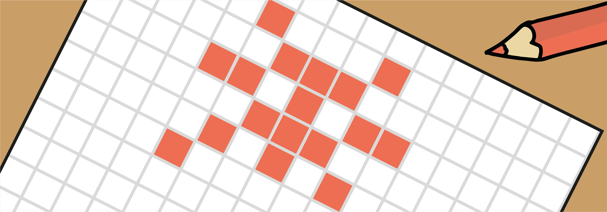
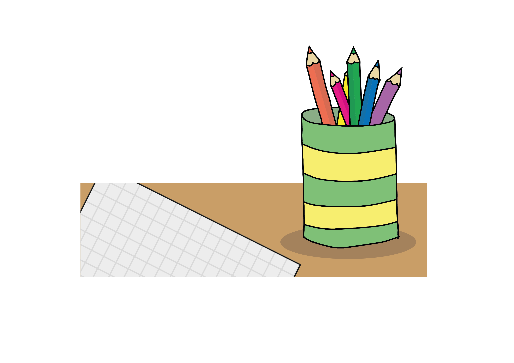

## Introduction

You will be working in pairs or threes and making your own pixel art pictures.

This project is also available as a PDF to download and print [rpf.io/cc-unplugged-pixelart](http://rpf.io/cc-unplugged-pixelart).

--- collapse ---
---
title: What you will need
---

+ Coloured pens or pencils
+ Printouts of this project, or squared paper

--- /collapse ---

--- collapse ---
---
title: What you will learn
---

+ How computers create and store images
+ How to use (x, y) coordinates

--- /collapse ---

--- collapse ---
---
title: Additional information for educators
---

You can [download digital and print layout PDFs for this project here](http://rpf.io/p/en/pixel-art-unplugged-go){:target="_blank"}.

You can [download the solutions for this project here](http://rpf.io/p/en/pixel-art-unplugged-get){:target="_blank"}.

--- /collapse ---
