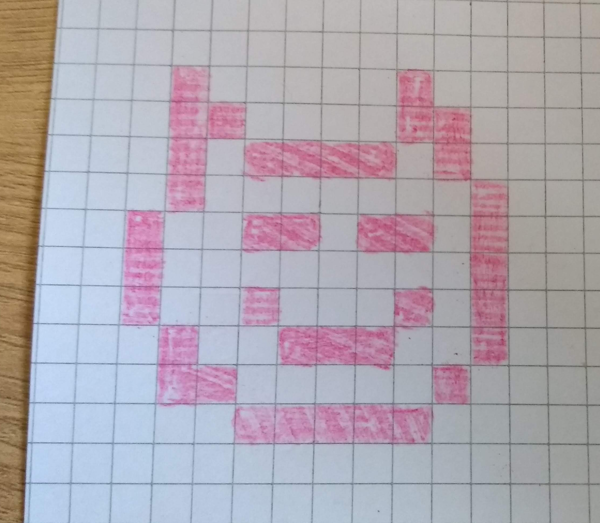
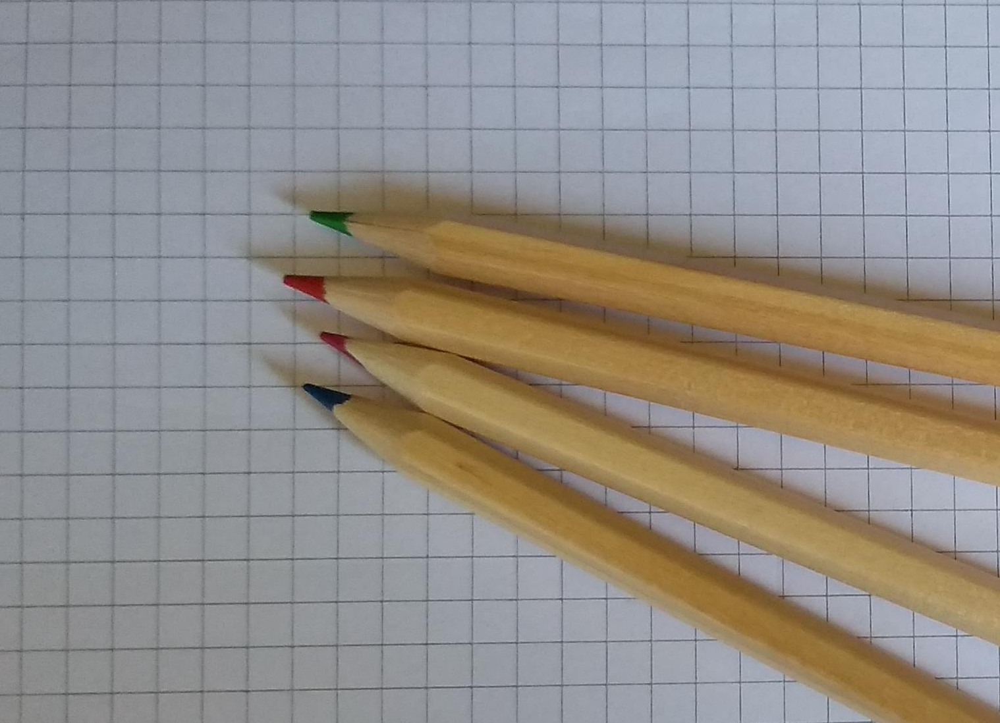

## Introduction

You will be working in pairs of threes and making your own Pixel Art pictures.

DESIGN - pictures of what you will make but on proper bit of paper, coloured with pencils

--- collapse ---
---
title: What you will need
---

+ Coloured pens or pencils
+ Print outs of this project or squared paper.

DESIGN - image of the stuff you need

--- /collapse ---

--- collapse ---
---
title: What you will learn
---

+ How computers create and store images
+ How to use x,y coordinates

--- /collapse ---

--- collapse ---
---
title: Additional information for educators
---

If you need to print this project, please use the [printer-friendly version](https://projects.raspberrypi.org/en/projects/pixel-art-unplugged/print){:target="_blank"}.

[Here is a link to the resources for this project](http://rpf.io/pixel-art-unplugged-go).

--- /collapse ---
