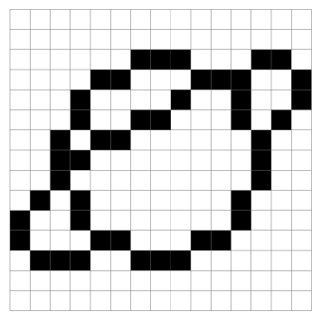

## Pixels

Computer screens are divided up into a grid of very small dots called pixels (picture elements). In a black and white picture, each pixel is either black or white. In a colour picture, each pixel is a single colour. These images show how pixels make images.

Computers represent everything, even pictures, through numbers. This means that when you design a picture for the computer, you need to make sure you have represented the picture in numbers. In this picture below, for example, you can see how each square on the grid corresponds to a coordinate for each row (starting with 0). 

Computers code images by reading the coordinates of coloured pixels. For computers, the grid numbering starts from (0,0) at the top left-hand corner of the grid (the opposite to maps!). This is because computers use the same coordinates as old-fashioned televisions, which display images in horizontal lines from left to right and top to bottom.

--- task ---

Decode this image by colouring in the right coordinates. You can use whichever colour you like. What image do you see? 

--- /task ---

