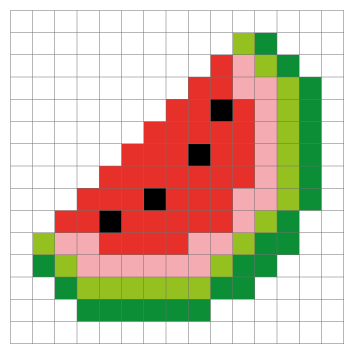
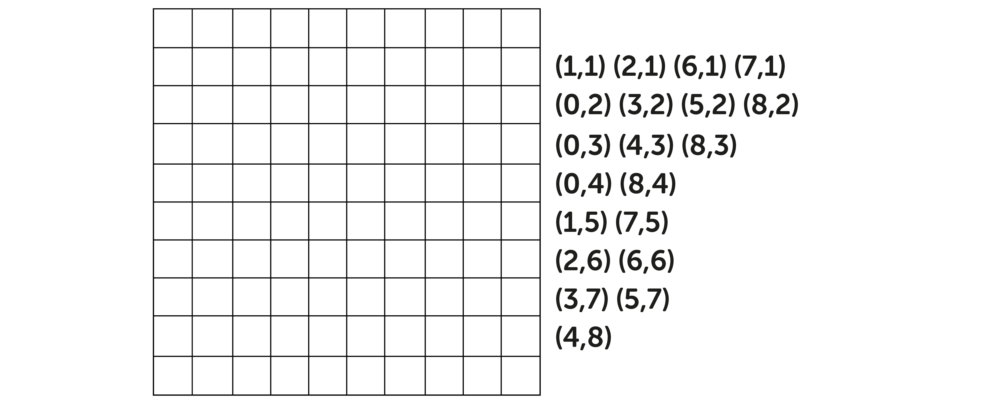

## Pixels

Computer screens, and the pictures they show, are divided up into grids of very small dots called pixels (picture elements). When you zoom in on a picture, you can see its pixels.

DESIGN - a suitable picture and a zoomed in section showing the pixels.

These images show how you can use pixels to make art.

Computers represent everything, even pictures, with numbers. This means that when you design a picture for a computer, you need to turn the picture's pixels into numbers. 

Here you can see how each square on the grid corresponds to a coordinate for each row. 

The grid numbering starts at (0, 0) in the top left-hand corner of the grid. This is because computers use the same (x, y)coordinates as old-fashioned televisions, which display images in horizontal lines from left to right, starting at the top and moving downwards.

--- task ---

Decode this image by colouring in the right coordinates. You can use whichever colour you like. What does the image show? 

DESIGN - Same as this, but including 0-10 labels for X and Y (same as the above image.)

--- /task ---
