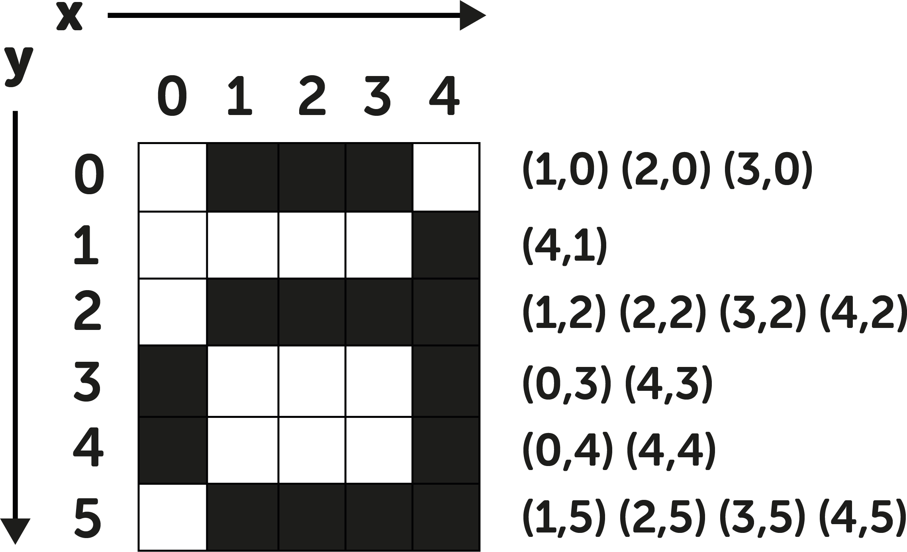

## Pixels

Computer screens are divided up into a grid of very small dots called pixels (picture elements), by zooming in on pictures you can see the pixels.

DESIGN - a suitable picture and a zoomed in section showing the pixels.

These images show how you can use pixels to make art.

Computers represent everything, even pictures, with numbers. This means that when you design a picture for the computer, you need to make turn the pixels into numbers. 

In this picture you can see how each square on the grid corresponds to a coordinate for each row. 

The grid numbering starts from (0,0) at the top left-hand corner of the grid, this is because computers use the same coordinates as old-fashioned televisions, which display images in horizontal lines from left to right and top to bottom.

--- task ---

Decode this image by colouring in the right coordinates. You can use whichever colour you like. What image do you see? 

DESIGN - Same as this, but including 0-10 labels for X and Y (same as the above image.)

--- /task ---
