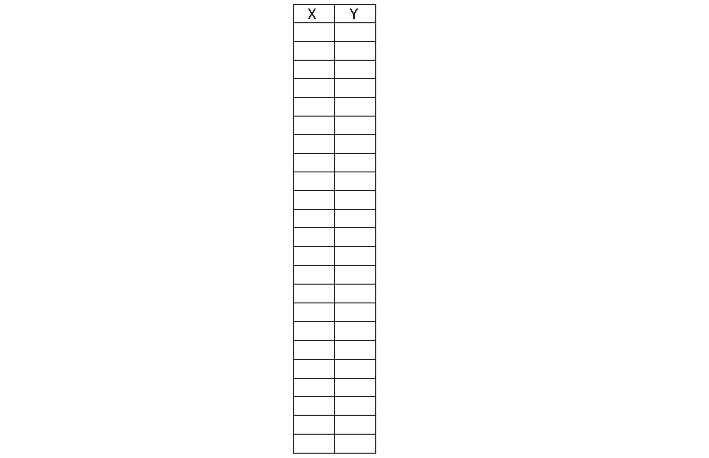

## Encode your picture

Now it's time to turn your pixel art into numbers a computer (or a friend) can understand and try to decode!

--- task ---

Write down the (x, y) coordinates of the pixels which you coloured in.

--- /task ---

--- task ---

Swap your coordinates with a friend so they can try to decode your image and you can decode theirs.

--- /task ---
