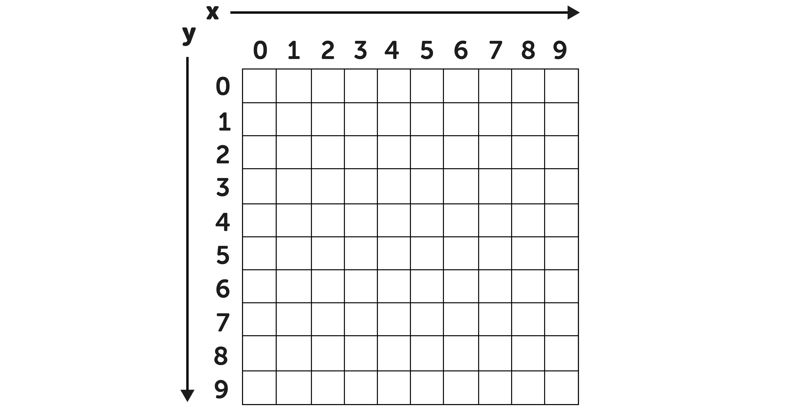

## Encode your picture

Now its time to turn your pixel art into numbers a computer (or a friend) can understand and see if they can turn it back into an image.

--- task ---

Write down the X and Y coordinates of the pixels which are coloured.

DESIGN - a table 2 x 25 with the column headings X, Y

<table style="border: 1px solid black;" frame="void" rules="all">
  <tr>
    <th style="width: 50px">X</th>
    <th style="width: 50px">Y</th> 
  </tr>
  <tr>
    <td>&nbsp;</td>
    <td>&nbsp;</td> 
  </tr>
  <tr>
    <td>&nbsp;</td>
    <td>&nbsp;</td> 
  </tr>
  <tr>
    <td>&nbsp;</td>
    <td>&nbsp;</td> 
  </tr>
  <tr>
    <td>&nbsp;</td>
    <td>&nbsp;</td> 
  </tr>
  <tr>
    <td>&nbsp;</td>
    <td>&nbsp;</td> 
  </tr>
  <tr>
    <td>&nbsp;</td>
    <td>&nbsp;</td> 
  </tr>
  <tr>
    <td>&nbsp;</td>
    <td>&nbsp;</td> 
  </tr>
  <tr>
    <td>&nbsp;</td>
    <td>&nbsp;</td> 
  </tr>
  <tr>
    <td>&nbsp;</td>
    <td>&nbsp;</td> 
  </tr>
  <tr>
    <td>&nbsp;</td>
    <td>&nbsp;</td> 
  </tr>
  <tr>
    <td>&nbsp;</td>
    <td>&nbsp;</td> 
  </tr>
  <tr>
    <td>&nbsp;</td>
    <td>&nbsp;</td> 
  </tr>
  <tr>
    <td>&nbsp;</td>
    <td>&nbsp;</td> 
  </tr>
  <tr>
    <td>&nbsp;</td>
    <td>&nbsp;</td> 
  </tr>
  <tr>
    <td>&nbsp;</td>
    <td>&nbsp;</td> 
  </tr>
  <tr>
    <td>&nbsp;</td>
    <td>&nbsp;</td> 
  </tr>
  <tr>
    <td>&nbsp;</td>
    <td>&nbsp;</td> 
  </tr>
  <tr>
    <td>&nbsp;</td>
    <td>&nbsp;</td> 
  </tr>
  <tr>
    <td>&nbsp;</td>
    <td>&nbsp;</td> 
  </tr>
  <tr>
    <td>&nbsp;</td>
    <td>&nbsp;</td> 
  </tr>
  <tr>
    <td>&nbsp;</td>
    <td>&nbsp;</td> 
  </tr>
  <tr>
    <td>&nbsp;</td>
    <td>&nbsp;</td> 
  </tr>
  <tr>
    <td>&nbsp;</td>
    <td>&nbsp;</td> 
  </tr>
  <tr>
    <td>&nbsp;</td>
    <td>&nbsp;</td> 
  </tr>
  <tr>
    <td>&nbsp;</td>
    <td>&nbsp;</td> 
  </tr>
  <tr>
    <td>&nbsp;</td>
    <td>&nbsp;</td> 
  </tr>
</table>

--- /task ---

--- task ---

Swap your co-ordinates with a friend and ask them to decode your image.

DESIGN - Empty 10x10 grid with 0-10 labels for X, Y across the top and left.

--- /task ---
