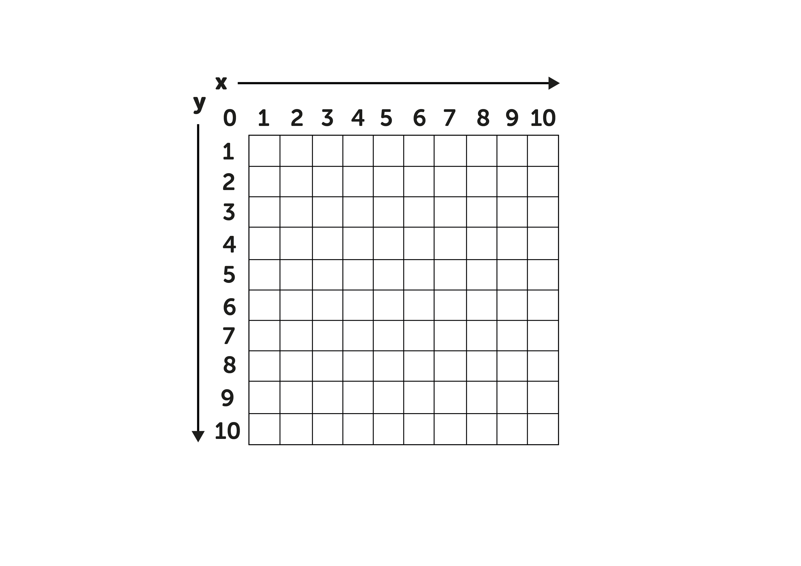

## Challenge: Create a multi-colour picture

At the moment your pixel art pictures are mono-tone i.e. they only use 1 colour.

Can you create and then encode a pixel art image which has more than 1 colour.

--- hints ---

--- hint ---

When you encoded a mono-tone image you only needed **2** columns (X & Y), for multi-colour pictures you will need at least **3**.

--- /hint ---

--- /hints ---

.

<table style="border: 1px solid black;" frame="void" rules="all">
  <tr>
    <th>&nbsp;</th>
    <th>&nbsp;</th> 
    <th>&nbsp;</th> 
    <th>&nbsp;</th> 
    <th>&nbsp;</th> 
    <th>&nbsp;</th> 
  </tr>
  <tr>
    <td>&nbsp;</td>
    <td>&nbsp;</td> 
    <td>&nbsp;</td> 
    <td>&nbsp;</td> 
    <td>&nbsp;</td> 
    <td>&nbsp;</td> 
  </tr>
  <tr>
    <td>&nbsp;</td>
    <td>&nbsp;</td> 
    <td>&nbsp;</td> 
    <td>&nbsp;</td> 
    <td>&nbsp;</td> 
    <td>&nbsp;</td> 
  </tr>
  <tr>
    <td>&nbsp;</td>
    <td>&nbsp;</td> 
    <td>&nbsp;</td> 
    <td>&nbsp;</td> 
    <td>&nbsp;</td> 
    <td>&nbsp;</td> 
  </tr>
  <tr>
    <td>&nbsp;</td>
    <td>&nbsp;</td> 
    <td>&nbsp;</td> 
    <td>&nbsp;</td> 
    <td>&nbsp;</td> 
    <td>&nbsp;</td> 
  </tr>
  <tr>
    <td>&nbsp;</td>
    <td>&nbsp;</td> 
    <td>&nbsp;</td> 
    <td>&nbsp;</td> 
    <td>&nbsp;</td> 
    <td>&nbsp;</td> 
  </tr>
  <tr>
    <td>&nbsp;</td>
    <td>&nbsp;</td> 
    <td>&nbsp;</td> 
    <td>&nbsp;</td> 
    <td>&nbsp;</td> 
    <td>&nbsp;</td> 
  </tr>
  <tr>
    <td>&nbsp;</td>
    <td>&nbsp;</td> 
    <td>&nbsp;</td> 
    <td>&nbsp;</td> 
    <td>&nbsp;</td> 
    <td>&nbsp;</td> 
  </tr>
  <tr>
    <td>&nbsp;</td>
    <td>&nbsp;</td> 
    <td>&nbsp;</td> 
    <td>&nbsp;</td> 
    <td>&nbsp;</td> 
    <td>&nbsp;</td> 
  </tr>
  <tr>
    <td>&nbsp;</td>
    <td>&nbsp;</td> 
    <td>&nbsp;</td> 
    <td>&nbsp;</td> 
    <td>&nbsp;</td> 
    <td>&nbsp;</td> 
  </tr>
  <tr>
    <td>&nbsp;</td>
    <td>&nbsp;</td> 
    <td>&nbsp;</td> 
    <td>&nbsp;</td> 
    <td>&nbsp;</td> 
    <td>&nbsp;</td> 
  </tr>
  <tr>
    <td>&nbsp;</td>
    <td>&nbsp;</td> 
    <td>&nbsp;</td> 
    <td>&nbsp;</td> 
    <td>&nbsp;</td> 
    <td>&nbsp;</td> 
  </tr>
  <tr>
    <td>&nbsp;</td>
    <td>&nbsp;</td> 
    <td>&nbsp;</td> 
    <td>&nbsp;</td> 
    <td>&nbsp;</td> 
    <td>&nbsp;</td> 
  </tr>
  <tr>
    <td>&nbsp;</td>
    <td>&nbsp;</td> 
    <td>&nbsp;</td> 
    <td>&nbsp;</td> 
    <td>&nbsp;</td> 
    <td>&nbsp;</td> 
  </tr>
  <tr>
    <td>&nbsp;</td>
    <td>&nbsp;</td> 
    <td>&nbsp;</td> 
    <td>&nbsp;</td> 
    <td>&nbsp;</td> 
    <td>&nbsp;</td> 
  </tr>
  <tr>
    <td>&nbsp;</td>
    <td>&nbsp;</td> 
    <td>&nbsp;</td> 
    <td>&nbsp;</td> 
    <td>&nbsp;</td> 
    <td>&nbsp;</td> 
  </tr>
  <tr>
    <td>&nbsp;</td>
    <td>&nbsp;</td> 
    <td>&nbsp;</td> 
    <td>&nbsp;</td> 
    <td>&nbsp;</td> 
    <td>&nbsp;</td> 
  </tr>
  <tr>
    <td>&nbsp;</td>
    <td>&nbsp;</td> 
    <td>&nbsp;</td> 
    <td>&nbsp;</td> 
    <td>&nbsp;</td> 
    <td>&nbsp;</td> 
  </tr>
  <tr>
    <td>&nbsp;</td>
    <td>&nbsp;</td> 
    <td>&nbsp;</td> 
    <td>&nbsp;</td> 
    <td>&nbsp;</td> 
    <td>&nbsp;</td> 
  </tr>
  <tr>
    <td>&nbsp;</td>
    <td>&nbsp;</td> 
    <td>&nbsp;</td> 
    <td>&nbsp;</td> 
    <td>&nbsp;</td> 
    <td>&nbsp;</td> 
  </tr>
  <tr>
    <td>&nbsp;</td>
    <td>&nbsp;</td> 
    <td>&nbsp;</td> 
    <td>&nbsp;</td> 
    <td>&nbsp;</td> 
    <td>&nbsp;</td> 
  </tr>
  <tr>
    <td>&nbsp;</td>
    <td>&nbsp;</td> 
    <td>&nbsp;</td> 
    <td>&nbsp;</td> 
    <td>&nbsp;</td> 
    <td>&nbsp;</td> 
  </tr>
  <tr>
    <td>&nbsp;</td>
    <td>&nbsp;</td> 
    <td>&nbsp;</td> 
    <td>&nbsp;</td> 
    <td>&nbsp;</td> 
    <td>&nbsp;</td> 
  </tr>
  <tr>
    <td>&nbsp;</td>
    <td>&nbsp;</td> 
    <td>&nbsp;</td> 
    <td>&nbsp;</td> 
    <td>&nbsp;</td> 
    <td>&nbsp;</td> 
  </tr>
  <tr>
    <td>&nbsp;</td>
    <td>&nbsp;</td> 
    <td>&nbsp;</td> 
    <td>&nbsp;</td> 
    <td>&nbsp;</td> 
    <td>&nbsp;</td> 
  </tr>
  <tr>
    <td>&nbsp;</td>
    <td>&nbsp;</td> 
    <td>&nbsp;</td> 
    <td>&nbsp;</td> 
    <td>&nbsp;</td> 
    <td>&nbsp;</td> 
  </tr>
</table>