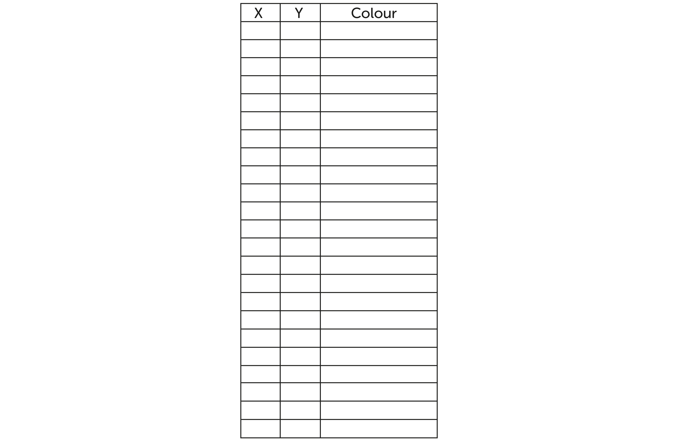

## Challenge: create a multicolour picture

At the moment ,your pixel art pictures are monochrome, meaning they only use one colour.

Can you create and then encode a pixel art image which has more than one colour?

--- hints ---

--- hint ---

To encode a monochrome image, you only need **two** columns (for x and y). For multicolour pictures, you need at least one more column to store the colour.

--- /hint ---

--- /hints ---

